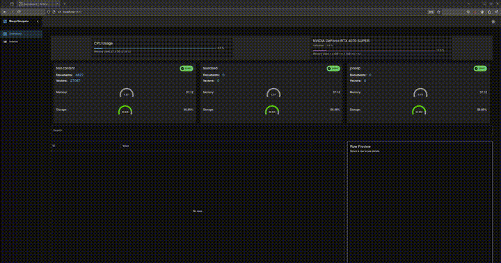

# 🧭 Marqo Navigator 

<div align="center" style="margin: 30px;">
    <a href="https://refine.dev">
    
    </a>
</div>
<br/>

<div align="center" style="margin: 30px;">
    
    <p>Developed by Forgemaster AI</p>
</div>
<br/>

## 📚 Overview

Marqo Navigator is a frontend development tool designed to streamline the interaction between React applications and backend services. Utilizing Vite as its core build tool, this project allows for a fast and efficient development experience, with built-in features such as API proxying and CORS handling. The primary purpose of the Marqo Navigator is to facilitate seamless development workflows while integrating complex API interactions.

This [Refine](https://github.com/refinedev/refine) project was generated with [create refine-app](https://github.com/refinedev/refine/tree/master/packages/create-refine-app).

## 👀 How it looks 

<div align="center" style="margin: 30px;">
    
    </a>
</div>
<br/>

## ✨ Key Features of Marqo Navigator

### 1. User Interface for Index Management
- **Create, Update, Delete**: Intuitive UI allowing users to manage indexes effortlessly, facilitating the creation, updating, and deletion of indexes as needed.

### 2. Search Functionality
- **Search in Existing Indexes**: Users can perform searches across existing indexes.
- **Record Preview**: Provides a preview of records within the search results, enhancing the user experience by allowing quick access to relevant information.

### 3. Kubernetes Integration
- **Sidecar Container**: The application can be deployed as a sidecar container within Kubernetes (k8s) environments.
- **Prometheus Metrics Exposure**: Exposes CUDA and index metrics to Prometheus, enabling real-time monitoring and performance tracking of the application.

These features collectively enhance the functionality and usability of Marqo Navigator, making it an effective tool for managing and interacting with indexes in a seamless manner. 

## Getting Started 🚀

A React Framework for building internal tools, admin panels, dashboards & B2B apps with unmatched flexibility ✨

Refine's hooks and components simplify the development process and eliminate the repetitive tasks by providing industry-standard solutions for crucial aspects of a project, including authentication, access control, routing, networking, state management, and i18n.

## 🧱 Structure:
The directory and file structure for the Marqo Navigator project is organized as follows:

```
marqo-navigator/
│
├── README.MD                 # Project aumentation
├── index.html                # HTML entry point for the application
├── package.json              # Node.js package configuration
├── vite.config.ts            # Vite configuration file (for build setup)
│
└── src/                      # Source code directory
    ├── App.tsx               # Main React application component
    ├── components/           # Reusable UI components
    │   ├── dashboard/        # Dashboard components (e.g., device-bar, search-table)
    │   └── header/           # Header components for navigation
    │  
    ├── contexts/             # Context providers for global state management
    │   └── color-mode/       # Color mode context (light/dark theme)
    │
    ├── pages/                # Routed pages of the application 
    │   ├── dashboard.tsx      # Dashboard page component
    │   ├── indexes/           # Index management pages (create, edit, list, show)
    │   └── ...
    │  
    └── marqo/                # Marqo specific functionalities
        └── dataloader.ts     # Data loading logic for interacting with Marqo engine
```


## Available Scripts 🛠️

### Running the development server.

```bash
    pnpm dev
```

### Building for production.

```bash
    pnpm build
```

### Running the production server.

```bash
    pnpm start
```
### Developing in K8S
- Step 1: Start the cluster https://minikube.sigs.k8s.io/docs/start/
```bash
curl -LO https://github.com/kubernetes/minikube/releases/latest/download/minikube-linux-amd64
sudo install minikube-linux-amd64 /usr/local/bin/minikube && rm minikube-linux-amd64
minikube start
# for gpu support https://minikube.sigs.k8s.io/docs/tutorials/nvidia/
minikube start --gpus all --cpus=8
```
- Step 2: Install MarqoAI & Vespa

```bash
 bash k8s/k8s-vespa.sh
```
- Step 3 (Optional): Setup Development Server for proxy – if getting stuck join us on Slack  [](https://join.slack.com/t/forgemasterai/shared_invite/zt-2tat4oztx-qMLAm~U4DkY9iuTztmh2mw)

```bash
   curl -o- https://raw.githubusercontent.com/nvm-sh/nvm/v0.40.1/install.sh | bash


  export NVM_DIR="$HOME/.nvm"
   [ -s "$NVM_DIR/nvm.sh" ] && \. "$NVM_DIR/nvm.sh"  # This loads nvm
   [ -s "$NVM_DIR/bash_completion" ] && \. "$NVM_DIR/bash_completion"  # This loads nvm bash_completion
   nvm install node 

   npm install -g pnpm
   
   pnpm i

    #optional for debugging install dnsutils
   sudo apt update
   sudo apt install -y dnsutils

   #prepare and deploy marqo app
   (cd k8s/marqo_app_template/ && zip -r ../../app.zip .)
   # install the marqo app from k8s/marqo_app_template
   curl --header Content-Type:application/zip --data-binary @app.zip vespa-configserver-0.vespa-internal.vector-storage:8080/application/v2/tenant/default/prepareandactivate
```

### Docker release

```bash
 #!/bin/bash

 # Ensure the script exits if any command fails
 set -e

 # Update the patch version in package.json using pnpm
 pnpm version patch

 # Get the new version from package.json
 VERSION=$(jq -r '.version' package.json)

 # Build Docker images
 docker build . -t your-docker-repo/your-image-name:v$VERSION
 docker build . -t your-docker-repo/your-image-name:latest

 # Push Docker images
 docker push your-docker-repo/your-image-name:v$VERSION
 docker push your-docker-repo/your-image-name:latest

 echo "Docker images for version $VERSION have been built and pushed successfully."
 ```


 To adapt this script for your own use, replace `your-docker-repo/your-image-name` with your actual Docker repository and image name. This script automates the process of updating the patch version, building Docker images with versioned and latest tags, and pushing them to your Docker repository.


## Learn More 📚

To learn more about **Refine**, please check out the [Documentation](https://refine.dev/docs)

- **REST Data Provider** [Docs](https://refine.dev/docs/core/providers/data-provider/#overview)
- **Material UI** [Docs](https://refine.dev/docs/ui-frameworks/mui/tutorial/)
- **React Router** [Docs](https://refine.dev/docs/core/providers/router-provider/)

## License 📝

MIT
